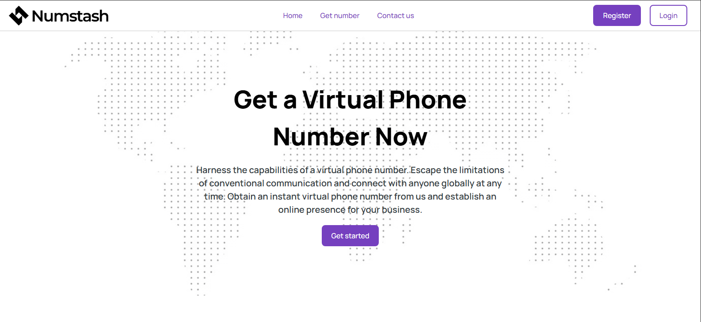

## About NumStash
NumStash is a dedicated application designed to provide non-VoIP phone numbers for reliable SMS verification services. In an increasingly digital world, many online platforms and services are implementing stricter verification processes that often reject VoIP (Voice over IP) numbers due to their association with spam or temporary usage.

NumStash aims to solve this problem by offering a platform where users can acquire real, non-VoIP numbers for the sole purpose of receiving critical SMS verification codes. This ensures seamless registration and access to services that demand traditional mobile numbers, enhancing user privacy by providing an alternative to using personal numbers for every online interaction.

## Key Use Case:
When a service requires a phone number for SMS verification (e.g., signing up for a new account, confirming a transaction, or resetting a password) and rejects your personal or VoIP number, NumStash steps in to provide a compliant, temporary number to complete that specific verification.

## Features
Non-VoIP Number Provisioning: Access to real, non-VoIP numbers suitable for various SMS verification needs.

<b>SMS Reception</b>: Securely receive SMS verification codes directly within the application interface.

<b>Temporary Number Allocation</b>: Numbers are allocated for specific, short-term verification tasks, ensuring efficient resource use and privacy.

<b>User Authentication</b>: Secure user registration and login to manage your numbers.

<b>Intuitive Dashboard</b>: A user-friendly interface to view available numbers, request new ones, and manage received SMS.

<b>API Integration (Planned)</b>: Future support for external applications to programmatically request and receive SMS.

<b>Admin Panel</b>: Manage numbers, users, and system settings.

## Technologies Used
NumStash is built on a robust and modern technology stack:

Backend: PHP 8.3+

Framework: Laravel 12.x

Database: MySQL (or PostgreSQL, SQLite, etc. as supported by Laravel)

Frontend: Blade Templates with Tailwind CSS (for styling) and Alpine.js/Vanilla JS (for interactivity)

Package Management: Composer (PHP), npm (JavaScript)

Local Development: Laravel Herd and Xampp

## Installation
Follow these steps to get NumStash up and running on your local machine for development and testing.

Prerequisites
Before you begin, ensure you have the following installed:

PHP (8.2 or higher): Download PHP

Composer (2.x or higher): Get Composer

Node.js & npm/Yarn: For frontend asset compilation. Download Node.js

Database Server: MySQL, PostgreSQL, or SQLite.

Git: Download Git

Recommended Local Development Environment:
For a seamless experience, consider using Laravel Herd (macOS & Windows) or Laravel Sail (Docker-based).